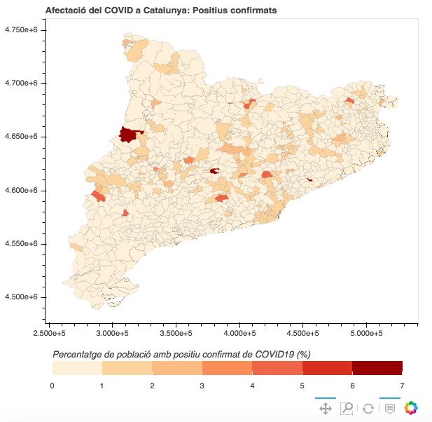

# Afectació del covid19 a Catalunya

### Positius confirmats per municipi

[Mapa interactiu](https://storage.googleapis.com/covid19catalunya/PositiusperMunicipi.html)

### Fonts de dades

* [Dades obertes Catalunya: Registre de casos de COVID-19 realitzats a Catalunya](https://analisi.transparenciacatalunya.cat/ca/Salut/Registre-de-casos-de-COVID-19-realitzats-a-Catalun/jj6z-iyrp)
* [Dades obertes Catalunya: Població de Catalunya per municipi, rang d'edat i sexe](https://analisi.transparenciacatalunya.cat/Demografia/Poblaci-de-Catalunya-per-municipi-rang-d-edat-i-se/b4rr-d25b)
* [Institut Cartogràfic i Geològic de Catalunya: Base municipal](https://www.icgc.cat/Administracio-i-empresa/Descarregues/Capes-de-geoinformacio/Base-municipal)
